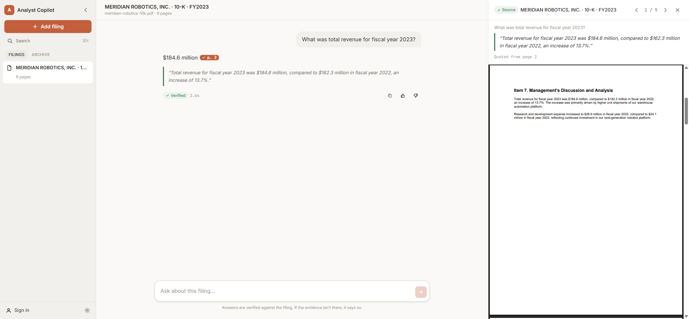

# Plutus

Question answering over company filings, with citations you can check.

Upload a filing (10-K, 10-Q, 8-K) as either a **PDF or the HTML EDGAR serves**, ask a
question in plain English, and get an answer with the exact page it came from — or an
honest "not found in this filing" when the evidence isn't there.



## Why you can trust the answers

A system that occasionally answers confidently and wrongly is worse than one that
says "I don't know" more often. For an analyst, an unsupported figure that reaches a
model or a memo costs far more than a gap someone fills by hand. The pipeline is
therefore built, tuned and measured against that asymmetry — a correct cited answer
scores +1, an honest refusal scores 0, and a confident wrong answer scores −1, so
guessing loses. That scoring policy is enforced in code, not just in evaluation:
see `backend/app/qa/answer_service.py`.

Every answer therefore has to clear three independent checks before you see it:

1. **Retrieval has to find something genuinely relevant.** A cross-encoder scores
   the question against each candidate passage; if nothing clears the bar, the model
   is never even called.
2. **The model has to claim it found an answer**, in a JSON schema that forces it to
   name a page and quote.
3. **The quote has to actually exist on the page it cites**, and any number in the
   answer has to actually appear in that quote.

Fail any one and the answer becomes "not found in this filing". The model's own
confidence is never sufficient on its own — that's the entire point of step 3.

When it does decline, click **Show what was checked** to see the passages it
considered and how relevant they scored. A refusal you can inspect is far more
useful than an opaque shrug.

## Quick start

**On a machine with nothing installed**, double-click:

| | |
|---|---|
| **Windows** | `start.bat` |
| **macOS** | `start.command` |

It checks for Python 3.11+, Node 18+ and Docker, installs whatever is missing
(winget on Windows, Homebrew on macOS), creates the virtual environment,
installs both dependency trees, brings up Postgres and Qdrant, starts the app,
waits until it actually answers, and opens your browser. It is idempotent —
anything already present is detected and skipped, so a second run takes
seconds. `stop.bat` / `stop.command` shut everything down without touching your
data.

If you have no API key it will offer to save one; keys are free from
[Google AI Studio](https://aistudio.google.com/apikey) (generous free tier) or
[Groq](https://console.groq.com) (fast, smaller free tier). Any
OpenAI-compatible endpoint works — including a self-hosted vLLM or Ollama — by
setting `LLM_BASE_URL` and `LLM_MODEL`.

<details>
<summary>Or set it up by hand</summary>

```bash
docker compose up -d                     # Postgres + Qdrant
cp .env.example .env                     # paste your key into LLM_API_KEY

cd backend
python -m venv .venv
.venv/Scripts/activate                   # macOS/Linux: source .venv/bin/activate
pip install -r requirements.txt
python -m uvicorn app.main:app --port 8001

cd ../frontend                           # new terminal
npm install
npm run dev
```

Open the URL Vite prints. **There is no model server to start** — embeddings
and reranking run in-process; generation is a hosted API call.

> The first backend start downloads two small ONNX models (~150MB total) and
> applies database migrations. Subsequent starts take about two seconds.

</details>

## What you can do

| | |
|---|---|
| **Add filings** | Drag a **PDF or HTML** filing (`.pdf`, `.htm`, `.html`) onto the sidebar or use *Add filing*. Live status while it indexes. |
| **Ask questions** | Plain English. Answers carry an inline `p. N` citation chip. |
| **Check the evidence** | Click any citation — now or from an old answer — and the source panel opens to that exact page with the quote shown, for PDF and HTML filings alike. |
| **Organise** | Archive filings you're done with, or delete them. Delete is *soft*: the PDF and all history are kept and can be restored. |
| **Search** | `⌘K` / `Ctrl K` jumps to a filing or finds anything you've asked before. |
| **Sign in (optional)** | Everything works signed out. An account keeps your filings and history across devices, and lets you change your name and password. |
| **Copy answers** | Copies the answer together with its citation and quote, ready to paste into a note. |
| **Rate answers** | 👍/👎 on any answer, stored for later analysis. |

## Architecture

```
React + Vite ──HTTP──▶ FastAPI ──┬──▶ Postgres   (filings, users, history)   [Docker]
                                 ├──▶ Qdrant     (passage vectors)           [Docker]
                                 ├──▶ fastembed  (embeddings + reranking)    [in-process]
                                 └──▶ Gemini/Groq (answer generation)        [hosted API]
```

**Nothing needs starting before the app except Docker.** This is deliberate: an
earlier version ran a local model server, whose cold start took minutes on CPU and
was the single largest source of operational risk. See `DESIGN_NOTES.md`.

### The RAG pipeline

```
ingest   PDF or HTML → pages (+tables) → passages (page-anchored, table-safe)
              → batch embed → Qdrant + BM25 + page cache

ask      question
           ├─ BM25 top-25 ────┐
           └─ vectors top-25 ─┴→ reciprocal rank fusion → 12 candidates
           → cross-encoder rerank → best 8 passages
           → [ambiguous? widen the pool and rerank again]
           → [nothing relevant? stop here and decline]
           → LLM (JSON-constrained)
           → verification gate (quote on page? numbers in quote?)
           → cited answer  |  "not found in this filing"
```

Why each piece is there:

- **Hybrid retrieval.** BM25 catches exact financial vocabulary ("goodwill
  impairment", "SOFR"); vectors catch paraphrase. Neither alone is reliable.
- **Passage-level chunks with page anchors.** A whole 10-K page produces a badly
  diluted embedding; passages retrieve precisely while the page anchor keeps
  citations page-accurate.
- **Cross-encoder reranking.** Bi-encoders approximate relevance; a cross-encoder
  reads question and passage together. It's the largest single accuracy gain
  available, and its scores are *calibrated* — which is what makes the
  answer/decline threshold meaningful rather than a magic number. Model choice was
  benchmarked, not assumed: see `docs/BENCHMARKS.md`.
- **Adaptive escalation.** Most questions come back decisively relevant or
  decisively not. Only in the ambiguous middle — where a wrong call costs a point
  either way — does it widen the candidate pool and rerank again.
- **Tables kept whole.** Financial tables are where the numbers live; splitting one
  separates a figure from its label.
- **Both source formats, neither converted.** EDGAR publishes HTML; most people
  archive PDFs. HTML pages are found from the `page-break-after` markers filing
  generators emit. Converting HTML to PDF would have reused one parser, but a
  different renderer paginates differently, moving every citation off the page the
  source actually used.

### Running on different hardware

The same build is expected on a thin laptop, a many-core server and a box with
a dedicated GPU, so the local models are **sized from the machine at startup**
rather than to fixed constants (`backend/app/hardware.py`). `GET /health`
reports what was chosen, which is usually the fastest explanation for why two
machines running the same code differ in speed.

| Machine | ONNX threads | Batch | Runs on |
|---|---|---|---|
| 2 cores, 4GB | 1 | 16 | CPU |
| 4 cores, 8GB | 3 | 64 | CPU |
| 12 cores, 16GB | 9 | 64 | CPU |
| 32 cores, 64GB | 28 | 64 | CPU |
| 128 cores, 512GB | 124 | 64 | CPU |
| NVIDIA GPU | unrestricted | 256 | CUDA |
| Apple silicon | unrestricted | 256 | CoreML |

Two things drive this. **Cores are held back** because onnxruntime otherwise
claims every one, and on a laptop that makes the whole machine unresponsive
for the minutes an ingest runs — measured cost of reserving them is 1.4%.
The reservation is proportional at the small end and capped at four, so a
four-core laptop keeps a usable share and a 128-core server is not left
idling. **Batch size** was measured rather than guessed: on a 12-core laptop,
8 → 815ms/passage, 32 → 733, 64 → 707, 256 → 721, so the curve is flat past
64 and holding more in memory buys nothing.

**Acceleration is opt-in**, because the runtimes are ~1GB downloads and the
right one depends on the vendor — notably, **CUDA will not drive an AMD card**:

| Machine | Install | Provider used |
|---|---|---|
| **Apple silicon** | nothing | CoreML |
| NVIDIA, any OS | `pip install onnxruntime-gpu` | CUDA |
| **AMD or Intel on Windows** | `pip install onnxruntime-directml` | DirectML |
| AMD on Linux | ROCm wheel from AMD's index (not on PyPI) | ROCm/MIGraphX |
| Intel Mac, or no GPU | nothing to install | CPU |

See `backend/requirements-accelerate.txt` for the exact lines. Nothing in the
application changes — `hardware.py` notices the new provider has appeared and
routes both models to it. Getting this wrong is safe: a runtime whose provider
is unavailable simply is not used and the app falls back to the CPU. Both
bootstrap scripts check the installed adapters and say which package applies.

**Apple silicon is already accelerated** by the default install — CoreML is
compiled into the standard macOS wheel (confirmed present in the shipped
library), so it is detected and used with nothing extra. If CoreML turns out
slower than the CPU on a particular Mac, which is possible for a model this
small, set `FORCE_CPU=true`.

Every derived value can be pinned from `.env` when benchmarking, or when the
detected default is wrong for a particular box:

| Variable | Effect |
|---|---|
| `ONNX_THREADS` | Cores the models may use |
| `EMBED_BATCH_SIZE` | Passages per forward pass |
| `RERANK_BATCH_SIZE` | Documents per rerank pass |
| `FORCE_CPU` | Ignore a GPU that is present |

### Backend layout

```
backend/app/
  main.py          app factory + lifespan       config.py    settings
  exceptions.py    domain errors                domain/      models, enums
  db/              session, migrations, repositories/
  storage/         filing file store (PDF or HTML)
  ingestion/       parser (PDF), html_parser, chunker, embedder, pipeline
  retrieval/       bm25_index, fusion, reranker, retriever, qdrant_store
  qa/              llm_client, prompts, verifier, answer_service, chat_service
  api/             deps (DI), schemas (DTOs), errors, routes/
```

Repository pattern for data access, a service layer holding business logic, DI via
FastAPI `Depends`, DTOs kept separate from domain models, versioned SQL migrations,
and one central place mapping domain errors to HTTP status codes.

### Local state

Everything is local — no object storage, no cloud services.

```
storage/filings/{user_id|guest}/{filing_id}.pdf   uploaded originals   (host)
storage/index/{filing_id}/{passages,pages}.json   BM25 + verifier caches (host)
data/postgres-backup/                             pg_dump target       (host)
data/sample/                                      evaluation fixture   (tracked)
analyst_copilot_postgres                          Postgres data   (docker volume)
analyst_copilot_qdrant                            vector storage  (docker volume)
```

**Both datastores use Docker named volumes rather than host folders, and that is
a portability requirement rather than a preference.** Neither engine survives a
Windows bind mount. Postgres refuses to start unless its data directory is
`0700`, which a Windows mount cannot express — `chmod` there is a silent no-op.
Qdrant *starts*, which is worse, then stops completing writes: measured back to
back on one host, creating an empty collection took **0.07s** on a named volume
and **never returned** on a bind mount, while reads stayed at 3ms. Named volumes
behave identically on Windows, macOS and Linux.

**The backup set is a `pg_dump` plus `storage/filings/`.** Everything else is
derived — `storage/index/` and the vector store both rebuild by re-ingesting the
originals. Dump the database into a host folder with:

```bash
docker compose exec postgres pg_dump -U analyst analyst_copilot > data/postgres-backup/dump.sql
```

Deleting a filing sets `deleted_at`. Nothing is removed from disk, so a mistaken
delete is recoverable and any citation already shown still resolves.

## Configuration

All settings live in `.env` (see `.env.example`). The ones worth knowing:

| Variable | Default | Notes |
|---|---|---|
| `LLM_API_KEY` | — | **Required.** Key for the configured endpoint. |
| `LLM_MODEL` | `gemini-3.1-flash-lite` | Any model on the configured endpoint. |
| `LLM_BASE_URL` | Gemini | Any OpenAI-compatible endpoint (Groq, Together, OpenRouter, vLLM…). |
| `RELEVANCE_THRESHOLD` | `0.0` | Raise to decline more readily, lower to answer more readily. |
| `ENRICH_FILINGS` | `true` | Company/period extraction + suggested questions. Costs two extra API calls per upload. |
| `JWT_SECRET` | dev value | **Change for any non-local deployment.** |

If the provider's usage limit is hit, short bursts are retried automatically and a
genuine quota exhaustion is reported in the UI as *"AI usage limit reached"* with
guidance, rather than a generic failure.

## Tests

```bash
docker compose up -d          # tests use a dedicated analyst_copilot_test database
cd backend
python -m pytest tests/ -q
```

185 tests covering the parser (PDF and HTML), chunker, verifier,
BM25/fusion/reranker/retriever, workspace isolation between accounts,
answer service (every refusal path), repositories (including concurrency and soft
delete), rate-limit handling, and the full HTTP API. Integration tests run against
real Postgres, Qdrant and Groq rather than mocks — the seams between those are
exactly where the real bugs live. They skip cleanly if a service isn't running.

## Evaluating

```bash
cd backend && python scripts/eval.py
```

Runs the evaluation questions through the real pipeline — real parsing, retrieval,
reranking, generation and verification — and scores them on the policy above.
Current result on the bundled regression set: **+11/19** (12 answers correctly
cited), with zero hallucinations on genuinely unanswerable questions.

That set ships in `data/sample/` (two clearly fictional filings and 19 hand-written
questions with known page/quote ground truth), so the published number is
reproducible from a clean clone rather than taken on trust. Regenerate it with
`python scripts/build_sample_data.py`, or point the eval at your own corpus:

```bash
python scripts/eval.py --questions path/to/eval-questions.jsonl --filings-dir path/to/filings
python scripts/eval.py --local-vectors   # embedded Qdrant, no Docker needed
```

Run it before and after any change to chunking, retrieval or the verifier — it is
the regression test that a unit test can't be.

## Known limitations

- **No OCR.** Scanned pages with no text layer extract as empty. Every SEC EDGAR
  filing we expect is digitally native, but a scanned exhibit would be missed.
- **HTML without page-break markers becomes one page.** A handful of filings — mostly
  8-Ks — carry no pagination at all, so the whole document is page 1. The citation is
  still honest, just less precise.
- **One citation per answer.** A question needing synthesis across several pages
  can't be fully cited yet, so it will usually decline instead.
- **Repeated facts cost points.** Filings often state the same figure in both MD&A
  prose and a financial table. Citing the "wrong" one of two truthful locations
  scores 0 under the scoring policy — a property of how filings are written, not a
  bug.
- **Provider rate limits.** Groq's free tier is generous but finite; sustained use
  will reach it. The app reports this clearly rather than failing opaquely. For
  production volume, use a paid tier or a self-hosted endpoint.
